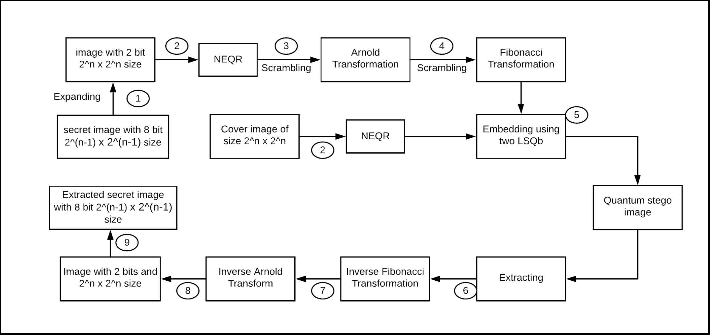

# QuantumSteganography
## Project Implemented by Simhadri. H. S
To Implement a Quantum Steganography scheme to embed quantum secret gray image into quantum cover image. In this scheme, the secret image and the cover image are represented using NEQR method. Then the quantum secret image is scrambled using two different scrambling techniques namely, Arnold Image Scrambling and Fibonacci Image Scrambling, in order to encrypt the secret image for security. We embed the  scrambled  quantum  secret  image  into  the  cover  image  using  two  least significant  Qubits  (LSQb)  to  obtain  the  final  stego-image.  The  secret  image extraction process requires only the stego image. Finally, the LSQb extracted image is descrambled using inverse Arnold transform and inverse Fibonacci transform. This decrypted image is resized to original size to get back the secret image.

